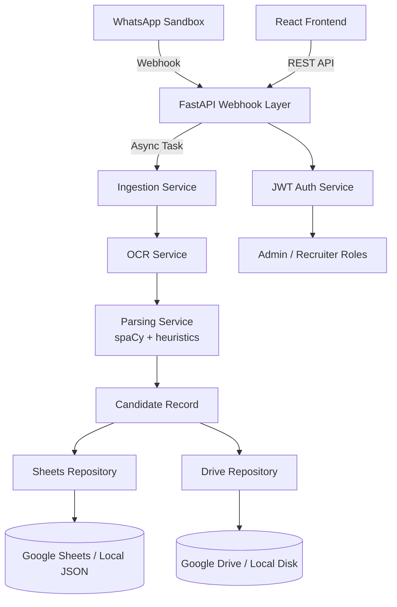

# SmartHire Gateway Architecture

## Overview

SmartHire Gateway ingests candidate resumes shared over WhatsApp, parses structured data with NLP/OCR, and stores the normalized records in Google Sheets (with optional Google Drive archival). Recruiters access data via a lightweight web console.

## Backend Components

- **FastAPI App (`backend/app`)**  
  Bootstraps routing, middleware, and documentation. Modular routers expose `/auth`, `/candidates`, `/whatsapp`, and `/health` endpoints.

- **Core Layer (`core/`)**  
  Environment-driven configuration, security helpers (JWT + bcrypt), and structured logging setup.

- **Services (`services/`)**
  - `WhatsAppService`: Validates Twilio signatures, normalizes incoming media, triggers ingestion, and issues auto-replies.
  - `IngestionService`: Orchestrates parsing and persistence; materializes attachment payloads for archival.
  - `ParsingService`: Combines message text with OCR outputs, extracts entities via spaCy, and augments results with heuristics.
  - `OCRService`: Handles PDFs (structured + OCR fallback), DOCX, images, and plain text with confidence scoring.
  - `StorageService`: Writes normalized records to Google Sheets (or local JSON fallback) and archives attachments to Drive/local disk.
  - `AuthService`: In-memory credential store for demo users with JWT issuance/verification.

- **Repositories (`repositories/`)**
  - `SheetsRepository`: Talks to Google Sheets; automatically switches to `data/dev/candidates.json` when credentials are absent.
  - `DriveRepository`: Uploads attachments to Google Drive or stores them under `data/dev/uploads`.
  - `AuditRepository`: In-memory event ledger for traceability.

- **Workers (`workers/`)**  
  Stubbed task entrypoints designed for Celery/RQ integration when moving heavy OCR off the request thread.

## Frontend

React + Vite dashboard with secure login, metrics overview, candidate table, and a manual ingest trigger that calls the backend manual endpoint. It reads tokens from local storage and forwards them via Axios interceptors.

## Data Flow Highlights

1. **Webhook Intake**  
   Twilio posts form data to `/api/whatsapp/webhook`. Signature validation ensures message integrity.
2. **Attachment Handling**  
   Media URLs are fetched with Twilio credentials and converted to base64; `OCRService` extracts text and precision score.
3. **Parsing Pipeline**  
   spaCy NER identifies names/locations; regex heuristics handle email/phone; skill matching leverages a curated library.
4. **Storage**  
   Records append to Google Sheets with atomic updates. Attachments optionally sync to Google Drive. Local fallbacks guarantee demo usability.
5. **Recruiter Experience**  
   Authenticated recruiters consume `/api/candidates` to populate the React dashboard. Auto-replies acknowledge applicants.

## Production Considerations

- Introduce message queues (Celery + Redis) to handle peak OCR loads.
- Swap in persistent databases (PostgreSQL) for candidate history and audit logs.
- Integrate enterprise SSO for recruiter login.
- Expand parsing with LLM-based extractors (+ deterministic validation).
- Harden security with secret rotation, HTTPS termination, and secret managers (GCP Secret Manager/AWS Secrets Manager).
